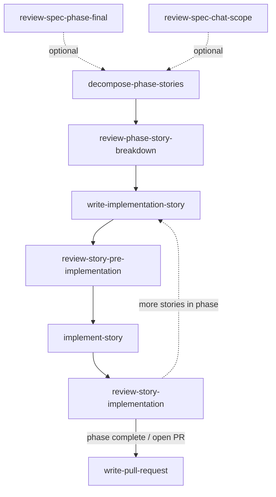

# Cursor skills — workflow order (source of truth)

This file is the **canonical happy-path and branching order** for Incident Assistant **Cursor agent skills** under `.cursor/skills/`. Other docs **must not duplicate** the full sequence; they link here instead.

**Related (different scope):** Phase gates and story lifecycle live in [`.cursor/rules/incident-assistant-project.mdc`](../rules/incident-assistant-project.mdc) (**Story-based implementation**). This README covers **which skill to use when**, not normative product rules.

**Skills in this folder:** `decompose-phase-stories`, `implement-story`, `review-phase-story-breakdown`, `review-spec-chat-scope`, `review-spec-phase-final`, `review-story-implementation`, `review-story-pre-implementation`, `write-implementation-story`, `write-pull-request` — nine directories, each with `SKILL.md`.

---

## Happy path (delivery spine)

Use this **ordered** chain for typical phase delivery. **Repeat steps 3–6** for each story in the phase (one active story at a time per project rules). **Step 7** usually runs when you open or polish a merge request (often once per branch or delivery slice).

### Diagram

Skill names match **directory names** under `.cursor/skills/` (nodes are only those skills).

Dotted inputs: **review-spec-phase-final** and **review-spec-chat-scope** are optional (see [Spec review skills](#spec-review-skills-optional)). From **review-story-implementation**, loop back to **write-implementation-story** until the backlog for this slice is done; then use **write-pull-request** once when opening or updating the merge request.

| Step | Skill directory | Role |
|------|-----------------|------|
| 1 | [`decompose-phase-stories`](decompose-phase-stories/SKILL.md) | Break the phase into `specs/phases/<phase>/stories/story-*.md` files (planning-only). |
| 2 | [`review-phase-story-breakdown`](review-phase-story-breakdown/SKILL.md) | Quality gate on the **entire** story set (ordering, independence, coverage). |
| 3 | [`write-implementation-story`](write-implementation-story/SKILL.md) | Author or rewrite **one** story file to the canonical template; also used when decomposition produced or updates stories. |
| 4 | [`review-story-pre-implementation`](review-story-pre-implementation/SKILL.md) | Go/no-go on a single story **before** coding (`Approved` gate). |
| 5 | [`implement-story`](implement-story/SKILL.md) | Implement **exactly one** approved story (code, tests, story artifact updates). |
| 6 | [`review-story-implementation`](review-story-implementation/SKILL.md) | Validate delivery against the story and specs **after** coding. |
| 7 | [`write-pull-request`](write-pull-request/SKILL.md) | Draft PR title/body when opening or polishing a merge request. |

---

## Spec review skills (optional)

These are **not** numbered steps on the spine; use **review-spec-chat-scope** during iteration on a subset of specs, and **review-spec-phase-final** when you want a full-phase spec sign-off before or during implementation.

| Skill directory | Role |
|-----------------|------|
| [`review-spec-phase-final`](review-spec-phase-final/SKILL.md) | Final sign-off on **all** specs for a phase. |
| [`review-spec-chat-scope`](review-spec-chat-scope/SKILL.md) | Critique specs scoped to the **current chat** or recent changes. |

---

## Branching and shortcuts

- **`write-implementation-story` without decomposition:** Use when adding or fixing a **single** story without re-running **decompose-phase-stories** / **review-phase-story-breakdown** for the whole phase.
- **`write-pull-request`:** May run anytime you need a standardized PR description; the spine lists it last as the usual handoff after **review-story-implementation**.

---

## Maintenance

When adding or renaming a skill directory, **update this file** (skill inventory in the intro, diagram, tables, and branching section) so it stays the single source of truth.
