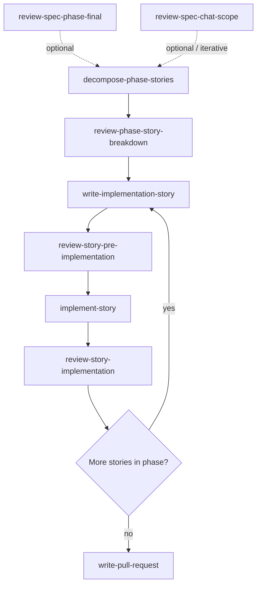

# Cursor skills — workflow order (source of truth)

This file is the **canonical happy-path and branching order** for Incident Assistant **Cursor agent skills** under `.cursor/skills/`. Other docs **must not duplicate** the full sequence; they link here instead.

**Related (different scope):** Phase gates and story lifecycle live in [`.cursor/rules/incident-assistant-project.mdc`](../rules/incident-assistant-project.mdc) (**Story-based implementation**). This README covers **which skill to use when**, not normative product rules.

---

## Happy path (typical phase delivery)

Use this order unless a situational branch below applies.

### Diagram

Dotted edges: spec-review skills are **not** strict prerequisites for every run—use when needed (see [Branching and shortcuts](#branching-and-shortcuts)). The **repeat** loop is steps **write → pre-impl → implement → post** per active story.

| Step | Skill directory | Role |
|------|-----------------|------|
| 1 | [`review-spec-phase-final`](review-spec-phase-final/SKILL.md) | Final sign-off on **all** specs for a phase before heavy implementation (optional if incremental review in step 1b already satisfied the team). |
| 1b | [`review-spec-chat-scope`](review-spec-chat-scope/SKILL.md) | **Alternative / additive:** critique specs **scoped to the current chat** or recent changes—use during iteration; does not replace phase-final when you need a whole-phase review. |
| 2 | [`decompose-phase-stories`](decompose-phase-stories/SKILL.md) | Break the phase into `specs/phases/<phase>/stories/story-*.md` files (planning-only). |
| 3 | [`review-phase-story-breakdown`](review-phase-story-breakdown/SKILL.md) | Quality gate on the **entire** story set (ordering, independence, coverage). |
| 4 | [`write-implementation-story`](write-implementation-story/SKILL.md) | Author or rewrite **one** story file to the canonical template; also used implicitly by decomposition. |
| 5 | [`review-story-pre-implementation`](review-story-pre-implementation/SKILL.md) | Go/no-go on a single story **before** coding (`Approved` gate). |
| 6 | [`implement-story`](implement-story/SKILL.md) | Implement **exactly one** approved story (code, tests, story artifact updates). |
| 7 | [`review-story-implementation`](review-story-implementation/SKILL.md) | Validate delivery against the story and specs **after** coding. |
| 8 | [`write-pull-request`](write-pull-request/SKILL.md) | Draft PR title/body when opening or polishing a merge request. |

**Repeat steps 4–7** for each story in the phase (one active story at a time per project rules).

---

## Branching and shortcuts

- **`review-spec-chat-scope` vs `review-spec-phase-final`:** Use **chat-scope** for ongoing, file-scoped spec review; use **phase-final** before treating a phase as ready for full implementation. They share the same checklist style; scope differs.
- **`write-implementation-story` without step 2:** Use when adding or fixing a **single** story without re-running full phase decomposition.
- **`write-pull-request`:** Can run anytime you need a standardized PR description; step 8 reflects the usual moment after implementation review.

---

## Maintenance

When adding or renaming a skill directory, **update this file** (diagram, table, and branching section) so it stays the single source of truth.
